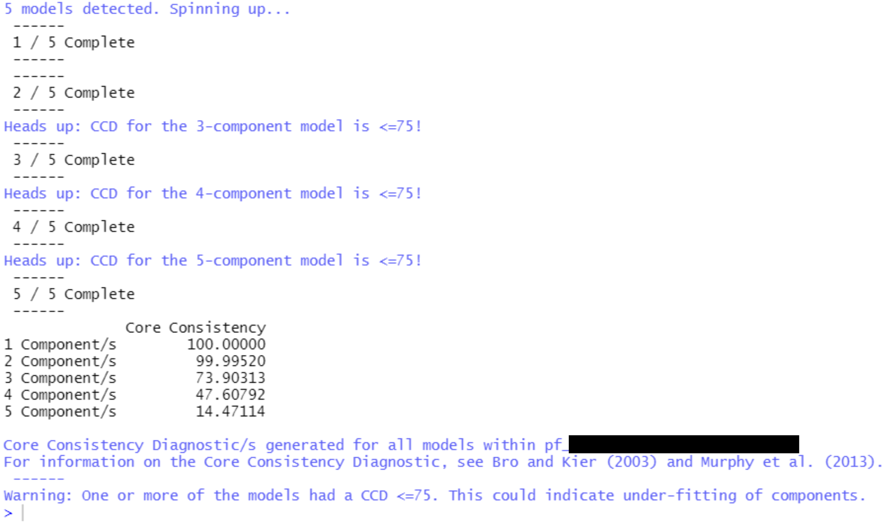

<!-- README.md is generated from README.Rmd. Please edit that file -->

```{r, include = FALSE}
knitr::opts_chunk$set(
  collapse = TRUE,
  comment = "#>",
  fig.path = "man/figures/README-",
  out.width = "100%"
)
```

# eemUtils

<!-- badges: start -->

<!-- badges: end -->

The **eemUtils** package serves as a repository for various functions to manipulate, analyse, and plot fluorescence data. It utilises the existing framework provided by the packages [eemR](https://cran.r-project.org/web/packages/eemR/index.html) and [staRdom](https://github.com/MatthiasPucher/staRdom). Many of the functions within this package are alterations to existing functions within from eemR or staRdom - thus, if you use the functions from this package, please allocate proper credit to those packages and their authors. Most eemUtils functions deal with fluorescence data, though some are general utility functions which, whilst a part of the fluorescence functions, can be used more generally.

This package is a work in progress - many of the functions were developed for a dataset currently in preparation for publication, and so I cannot currently upload data or detailed examples. The goal is to eventually upload that dataset and the accompanying workflow as an offshoot to this package.

If you have any questions or comments, please don't hesitate to get in touch.

## Example functions

Below are just a few of the 20+ functions contained within this package.

**plot_eem_3D**

A simple conversion of `staRdom::eempf_comps3D()`, but for use with sample EEM data, rather than outputs from a PARAFAC model.

```
plot_eem_3D()
```
<p align="center">
  
</p>

**Generate_CORCONDIA**

`Generate_CORCONDIA()` is a simple function wrapper for staRdom's existing core consistency diagnostic function `staRdom::eempf_corcondia()`. It produces a more legible output. 

<p align="center">
  
</p>

**extrpf_loadings**

Use `extrpf_loadings()` to get the modeled per-sample fluorescence intensity loadings for each component within a set of PARAFAC models. This is a simple way to get quick series data from any number of PARAFAC models generated by `staRdom::eem_parafac()`

**extract_ramanpeak_areas**

This function incorporates two methods in order to find the area under the Raman peak of water, for EEM data Raman Unit normalisation purposes. The first method utilises a port of the MATLAB package drEEM's RamanIntegrationRange function, which uses adjustable gradient detection to identify the start and end of the Raman peak. The second method is a straightforward, fixed-range integration used by the Aqualog fluorometer, which assumes the Raman peak extends from 380nm to 410nm at 350nm excitation.

Some sample Raman curve spectra are included in this package as a .csv file.


`extract_ramanpeak_areas()` can then be used to get the areas under the raman peaks, and exported as image and/or .gif files for visualisation. The below .gif shows a use of the drEEM RamanIntegrationRange method, using gradient detection. 


## Installation

To get access to the functions in **eemUtils**, simply use the **devtools** package to install the package from github.

```r
devtools::install_github("MRPHarris/eemUtils")
```
