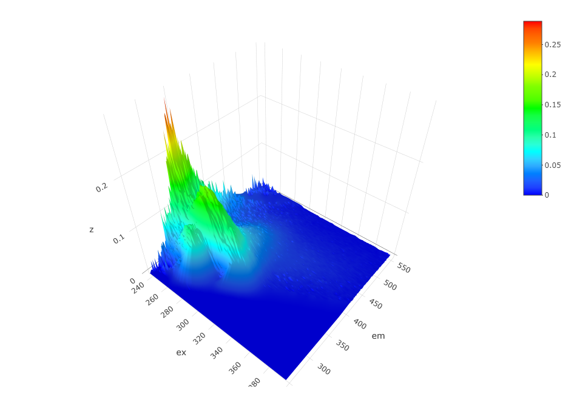
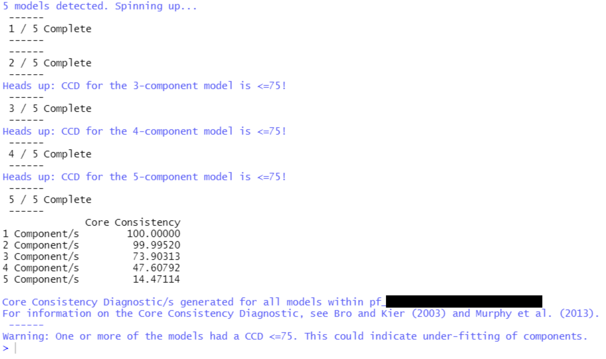
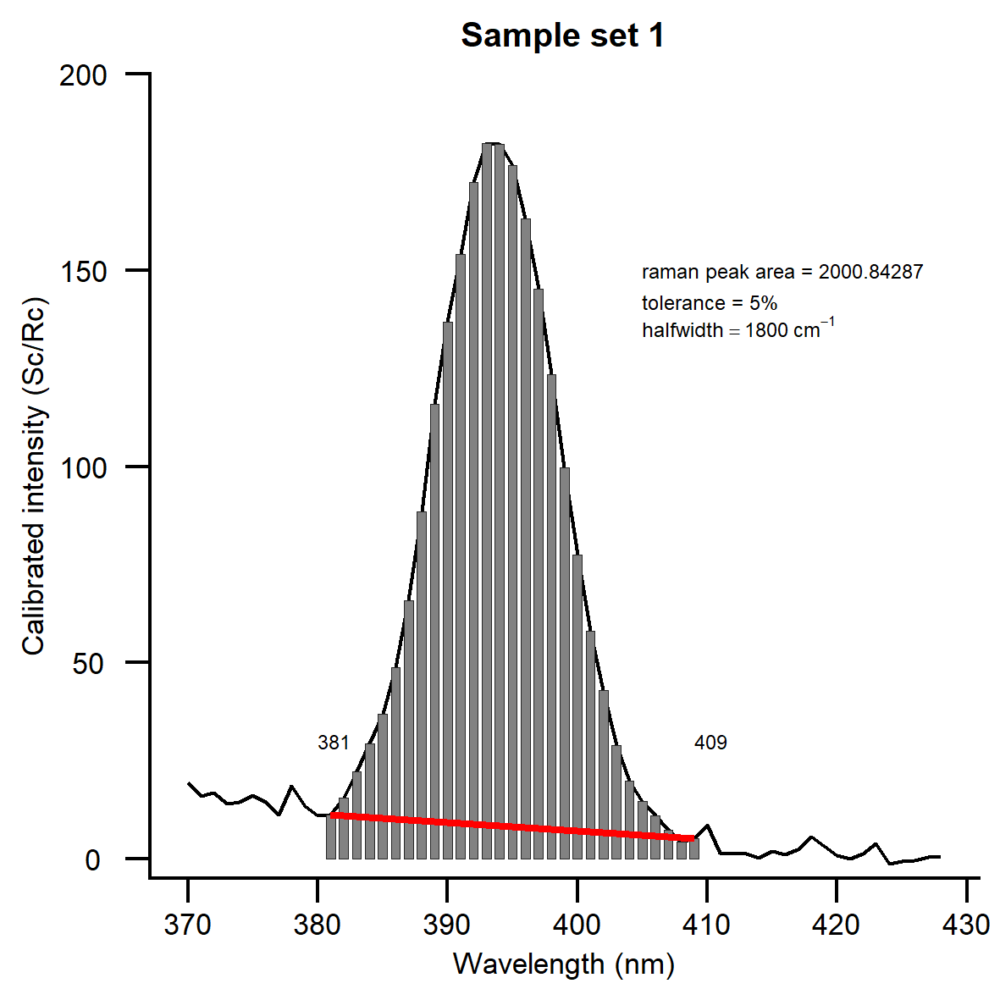

<!-- README.md is generated from README.Rmd. Please edit that file -->

# eemUtils

<!-- badges: start -->
<!-- badges: end -->

The **eemUtils** package is a collection of useful functions that act as
an expansion of the existing existing R fluorescence analysis framework
provided by the
[eemR](https://cran.r-project.org/web/packages/eemR/index.html),
[staRdom](https://github.com/MatthiasPucher/staRdom) and
[EEM](https://CRAN.R-project.org/package=EEM) packages. Many of the
functions within this package are alterations or wrappers for existing
functions from eemR, staRdom or EEM - thus, if you use the functions
from this package, please allocate proper credit to those packages and
their authors.

This package is a work in progress. Always back up your data!

If you have any questions or comments, I can be reached at
<m.r.p.harris@keele.ac.uk>.

## Example functions

Below are some examples of functions within this package.

#### ggeem2

An updated EEM plotter, directly adapted from `staRdom::ggeem()`. It
retains much of the same functionality, with tweaked graphical elements.
Designed for use in my thesis and future pubs. It has integrated options
for binning, and the default colour scheme takes after MATLAB’s ‘jet’
scheme. Below are two examples, using some Black Tea OM SRM.

###### plot here: placeholder

#### plot\_eem\_3D

A simple conversion of `staRdom::eempf_comps3D()`, but for use with
sample EEM data, rather than outputs from a PARAFAC model. Extremely
useful when checking individual samples for the presence of scatter
lines or artefacts, or for quickly identifying the point of maximum
fluorescence within part of an EEM.

    plot_eem_3D()

<p align="center">

</p>

#### Generate\_CORCONDIA

`Generate_CORCONDIA()` is a simple function wrapper for staRdom’s
existing core consistency diagnostic function
`staRdom::eempf_corcondia()`. It produces a more legible output.

<p align="center">

</p>

#### extrpf\_loadings

Use `extrpf_loadings()` to get the modeled per-sample fluorescence
intensity loadings for each component within a set of PARAFAC models.
This is a simple way to get quick series data from any number of PARAFAC
models generated by `staRdom::eem_parafac()`.

#### get\_pfload\_percent

Outputs from `extrpf_loadings()` can be immediately passed to
`get_pfload_percent()`, which will calculate the percentage contribution
of each modeled component to a given sample’s total fluorescence
intensity.

#### extract\_ramanpeak\_areas

This function incorporates two methods in order to find the area under
the Raman peak of water, for EEM data Raman Unit normalisation purposes.
The first method utilises a port of the MATLAB package drEEM’s
RamanIntegrationRange function, which uses adjustable gradient detection
to identify the start and end of the Raman peak. The second method is a
straightforward, fixed-range integration used by the Aqualog
fluorometer, which assumes the Raman peak extends from 380nm to 410nm at
350nm excitation.

Some sample Raman curve spectra are included in this package as below.

``` r
library(pacman)
#> Warning: package 'pacman' was built under R version 4.0.5
pacman::p_load(eemUtils,ggplot2,cowplot,pracma,magrittr,magick)
data(SampleRamanCurves)
head(SampleRamanCurves)
#>   Wavelength Spectra.1 Spectra.2 Spectra.3 Spectra.4 Spectra.5
#> 1    246.355   0.19417   1.20432  -2.23798  -6.22403  -0.47937
#> 2    247.477  -5.24265  -0.40144  -1.22071  -1.19693   0.23968
#> 3    248.599  -1.94172  -1.00360   3.86560  -0.95754   0.95873
#> 4    249.721   5.24265   1.00360  -0.61036   4.30894   4.07461
#> 5    250.844   3.29229  -4.31084  -1.83981  -7.30603   2.16744
#> 6    251.966   3.02511   8.04115  -1.35844 -10.92216  -4.00087
```

`extract_ramanpeak_areas()` can then be used to get the areas under the
raman peaks, and exported as image and/or .gif files for visualisation.
The below .gif shows a use of the drEEM RamanIntegrationRange method,
using gradient detection.

``` r
eemUtils::extract_ramanpeak_areas(RAMdat = SampleRamanCurves, range_upper = 500, method = "RIR", output_dir = NULL, gif = FALSE)
#> Legacy peak max at em397, lying between ex370:428
#> Registered S3 method overwritten by 'quantmod':
#>   method            from
#>   as.zoo.data.frame zoo
#> [01] IR = 381:409 | Peak Area = 2000.84287218425
#> [02] IR = 381:409 | Peak Area = 2005.96666376586
#> [03] IR = 381:408 | Peak Area = 1995.67397722841
#> [04] IR = 380:410 | Peak Area = 2041.30312091936
#> [05] IR = 378:408 | Peak Area = 2041.94451089284
```

This function can also optionally produce images or a .gif of the
detected peak bounds and areas.

<p align="center">

</p>

## Installation

To get access to the functions in **eemUtils**, simply use the
**devtools** package to install the package from github.

``` r
devtools::install_github("MRPHarris/eemUtils")
```

## Update Notes

23/09/21 \| An updated ggplot2-compatible EEM plotter, `ggeem2()`, has
been added. This function updates the plotting provided by staRdom’s
ggeem() function, tweaking the graphical parameters and adding an option
for intensity value binning via `eem_bin()`. The check\_eem() function
has been removed, as it is no longer useful.

01/10/21 \| `ggeem2()` now has multi-plot support, and inherits
staRdom::ggeem()’s class handling.

## References

Massicotte, P. (2019). eemR: Tools for Pre-Processing
Emission-Excitation-Matrix (EEM) Fluorescence Data. R package version
1.0.1. <https://CRAN.R-project.org/package=eemR>

Murphy, K. R., Stedmon, C. A., Graeber, D., & Bro, R. (2013).
Fluorescence spectroscopy and multi-way techniques. PARAFAC. *Analytical
Methods*, *5*, 6557–6566. doi:
[10.1039/C3AY41160E](https://doi.org/10.1039/C3AY41160E)

Pucher, M., Wünsch, U., Weigelhofer, G., Murphy, K., Hein, T., &
Graeber, D. (2019). staRdom: Versatile Software for Analyzing
Spectroscopic Data of Dissolved Organic Matter in R. *Water*, *11*,
2366. doi: [10.3390/w11112366](https://doi.org/10.3390/w11112366)

Trivittayasil, V. (2016). EEM: Read and Preprocess Fluorescence
Excitation-Emission Matrix (EEM) Data. R package version 1.1.1.
<https://CRAN.R-project.org/package=EEM>
