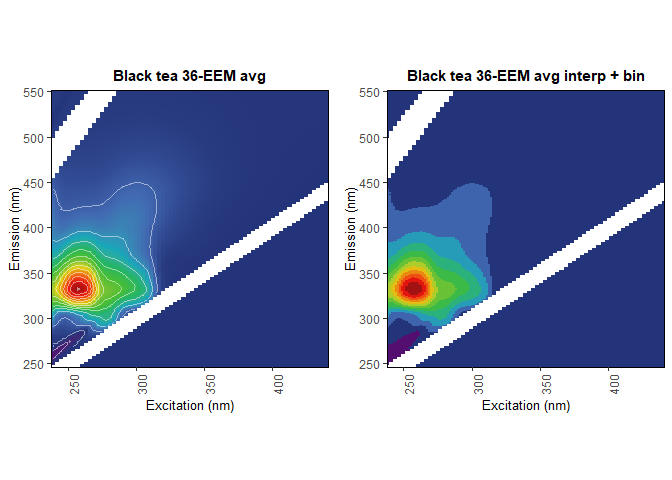

<!-- README.md is generated from README.Rmd. Please edit that file -->

# eemUtils

<!-- badges: start -->
<!-- badges: end -->

The **eemUtils** package is a collection of useful functions that act as
an expansion of the existing existing R fluorescence analysis framework
provided by the
[eemR](https://cran.r-project.org/web/packages/eemR/index.html),
[staRdom](https://github.com/MatthiasPucher/staRdom) and
[EEM](https://CRAN.R-project.org/package=EEM) packages. Many of the
functions within this package are alterations or wrappers for existing
functions from eemR, staRdom or EEM - thus, if you use the functions
from this package, please allocate proper credit to those packages and
their authors.

This package is a work in progress. Always back up your data!

If you have any questions or comments, I can be reached at
<m.r.p.harris@keele.ac.uk>.

## Example functions

Below are some examples of functions within this package.

#### ggeem2

An updated EEM plotter, directly adapted from staRdom’s ggeem. It
retains much of the same functionality, but is intended for direct use
with publication-style figues, losing the title and some other elements.
It has integrated options for binning, and the default colour scheme
takes after MATLAB’s jet scheme.

    #> finished loop 1/266
    #> finished loop 2/266
    #> finished loop 3/266
    #> finished loop 4/266
    #> finished loop 5/266
    #> finished loop 6/266
    #> finished loop 7/266
    #> finished loop 8/266
    #> finished loop 9/266
    #> finished loop 10/266
    #> finished loop 11/266
    #> finished loop 12/266
    #> finished loop 13/266
    #> finished loop 14/266
    #> finished loop 15/266
    #> finished loop 16/266
    #> finished loop 17/266
    #> finished loop 18/266
    #> finished loop 19/266
    #> finished loop 20/266
    #> finished loop 21/266
    #> finished loop 22/266
    #> finished loop 23/266
    #> finished loop 24/266
    #> finished loop 25/266
    #> finished loop 26/266
    #> finished loop 27/266
    #> finished loop 28/266
    #> finished loop 29/266
    #> finished loop 30/266
    #> finished loop 31/266
    #> finished loop 32/266
    #> finished loop 33/266
    #> finished loop 34/266
    #> finished loop 35/266
    #> finished loop 36/266
    #> finished loop 37/266
    #> finished loop 38/266
    #> finished loop 39/266
    #> finished loop 40/266
    #> finished loop 41/266
    #> finished loop 42/266
    #> finished loop 43/266
    #> finished loop 44/266
    #> finished loop 45/266
    #> finished loop 46/266
    #> finished loop 47/266
    #> finished loop 48/266
    #> finished loop 49/266
    #> finished loop 50/266
    #> finished loop 51/266
    #> finished loop 52/266
    #> finished loop 53/266
    #> finished loop 54/266
    #> finished loop 55/266
    #> finished loop 56/266
    #> finished loop 57/266
    #> finished loop 58/266
    #> finished loop 59/266
    #> finished loop 60/266
    #> finished loop 61/266
    #> finished loop 62/266
    #> finished loop 63/266
    #> finished loop 64/266
    #> finished loop 65/266
    #> finished loop 66/266
    #> finished loop 67/266
    #> finished loop 68/266
    #> finished loop 69/266
    #> finished loop 70/266
    #> finished loop 71/266
    #> finished loop 72/266
    #> finished loop 73/266
    #> finished loop 74/266
    #> finished loop 75/266
    #> finished loop 76/266
    #> finished loop 77/266
    #> finished loop 78/266
    #> finished loop 79/266
    #> finished loop 80/266
    #> finished loop 81/266
    #> finished loop 82/266
    #> finished loop 83/266
    #> finished loop 84/266
    #> finished loop 85/266
    #> finished loop 86/266
    #> finished loop 87/266
    #> finished loop 88/266
    #> finished loop 89/266
    #> finished loop 90/266
    #> finished loop 91/266
    #> finished loop 92/266
    #> finished loop 93/266
    #> finished loop 94/266
    #> finished loop 95/266
    #> finished loop 96/266
    #> finished loop 97/266
    #> finished loop 98/266
    #> finished loop 99/266
    #> finished loop 100/266
    #> finished loop 101/266
    #> finished loop 102/266
    #> finished loop 103/266
    #> finished loop 104/266
    #> finished loop 105/266
    #> finished loop 106/266
    #> finished loop 107/266
    #> finished loop 108/266
    #> finished loop 109/266
    #> finished loop 110/266
    #> finished loop 111/266
    #> finished loop 112/266
    #> finished loop 113/266
    #> finished loop 114/266
    #> finished loop 115/266
    #> finished loop 116/266
    #> finished loop 117/266
    #> finished loop 118/266
    #> finished loop 119/266
    #> finished loop 120/266
    #> finished loop 121/266
    #> finished loop 122/266
    #> finished loop 123/266
    #> finished loop 124/266
    #> finished loop 125/266
    #> finished loop 126/266
    #> finished loop 127/266
    #> finished loop 128/266
    #> finished loop 129/266
    #> finished loop 130/266
    #> finished loop 131/266
    #> finished loop 132/266
    #> finished loop 133/266
    #> finished loop 134/266
    #> finished loop 135/266
    #> finished loop 136/266
    #> finished loop 137/266
    #> finished loop 138/266
    #> finished loop 139/266
    #> finished loop 140/266
    #> finished loop 141/266
    #> finished loop 142/266
    #> finished loop 143/266
    #> finished loop 144/266
    #> finished loop 145/266
    #> finished loop 146/266
    #> finished loop 147/266
    #> finished loop 148/266
    #> finished loop 149/266
    #> finished loop 150/266
    #> finished loop 151/266
    #> finished loop 152/266
    #> finished loop 153/266
    #> finished loop 154/266
    #> finished loop 155/266
    #> finished loop 156/266
    #> finished loop 157/266
    #> finished loop 158/266
    #> finished loop 159/266
    #> finished loop 160/266
    #> finished loop 161/266
    #> finished loop 162/266
    #> finished loop 163/266
    #> finished loop 164/266
    #> finished loop 165/266
    #> finished loop 166/266
    #> finished loop 167/266
    #> finished loop 168/266
    #> finished loop 169/266
    #> finished loop 170/266
    #> finished loop 171/266
    #> finished loop 172/266
    #> finished loop 173/266
    #> finished loop 174/266
    #> finished loop 175/266
    #> finished loop 176/266
    #> finished loop 177/266
    #> finished loop 178/266
    #> finished loop 179/266
    #> finished loop 180/266
    #> finished loop 181/266
    #> finished loop 182/266
    #> finished loop 183/266
    #> finished loop 184/266
    #> finished loop 185/266
    #> finished loop 186/266
    #> finished loop 187/266
    #> finished loop 188/266
    #> finished loop 189/266
    #> finished loop 190/266
    #> finished loop 191/266
    #> finished loop 192/266
    #> finished loop 193/266
    #> finished loop 194/266
    #> finished loop 195/266
    #> finished loop 196/266
    #> finished loop 197/266
    #> finished loop 198/266
    #> finished loop 199/266
    #> finished loop 200/266
    #> finished loop 201/266
    #> finished loop 202/266
    #> finished loop 203/266
    #> finished loop 204/266
    #> finished loop 205/266
    #> finished loop 206/266
    #> finished loop 207/266
    #> finished loop 208/266
    #> finished loop 209/266
    #> finished loop 210/266
    #> finished loop 211/266
    #> finished loop 212/266
    #> finished loop 213/266
    #> finished loop 214/266
    #> finished loop 215/266
    #> finished loop 216/266
    #> finished loop 217/266
    #> finished loop 218/266
    #> finished loop 219/266
    #> finished loop 220/266
    #> finished loop 221/266
    #> finished loop 222/266
    #> finished loop 223/266
    #> finished loop 224/266
    #> finished loop 225/266
    #> finished loop 226/266
    #> finished loop 227/266
    #> finished loop 228/266
    #> finished loop 229/266
    #> finished loop 230/266
    #> finished loop 231/266
    #> finished loop 232/266
    #> finished loop 233/266
    #> finished loop 234/266
    #> finished loop 235/266
    #> finished loop 236/266
    #> finished loop 237/266
    #> finished loop 238/266
    #> finished loop 239/266
    #> finished loop 240/266
    #> finished loop 241/266
    #> finished loop 242/266
    #> finished loop 243/266
    #> finished loop 244/266
    #> finished loop 245/266
    #> finished loop 246/266
    #> finished loop 247/266
    #> finished loop 248/266
    #> finished loop 249/266
    #> finished loop 250/266
    #> finished loop 251/266
    #> finished loop 252/266
    #> finished loop 253/266
    #> finished loop 254/266
    #> finished loop 255/266
    #> finished loop 256/266
    #> finished loop 257/266
    #> finished loop 258/266
    #> finished loop 259/266
    #> finished loop 260/266
    #> finished loop 261/266
    #> finished loop 262/266
    #> finished loop 263/266
    #> finished loop 264/266
    #> finished loop 265/266
    #> finished loop 266/266
    #> Using default colour palette
    #> Using default colour palette
    #> binning vals based on a max EEM intensity of 2.41345747338507 and 12 bins.
    #> Warning: Removed 1656 rows containing non-finite values (stat_contour).



#### plot\_eem\_3D

A simple conversion of `staRdom::eempf_comps3D()`, but for use with
sample EEM data, rather than outputs from a PARAFAC model. Extremely
useful when checking individual samples for the presence of scatter
lines or artefacts, or for quickly identifying the point of maximum
fluorescence within part of an EEM.

    plot_eem_3D()

<p align="center">

</p>

#### Generate\_CORCONDIA

`Generate_CORCONDIA()` is a simple function wrapper for staRdom’s
existing core consistency diagnostic function
`staRdom::eempf_corcondia()`. It produces a more legible output.

<p align="center">

</p>

#### extrpf\_loadings

Use `extrpf_loadings()` to get the modeled per-sample fluorescence
intensity loadings for each component within a set of PARAFAC models.
This is a simple way to get quick series data from any number of PARAFAC
models generated by `staRdom::eem_parafac()`.

#### get\_pfload\_percent

Outputs from `extrpf_loadings()` can be immediately passed to
`get_pfload_percent()`, which will calculate the percentage contribution
of each modeled component to a given sample’s total fluorescence
intensity.

#### extract\_ramanpeak\_areas

This function incorporates two methods in order to find the area under
the Raman peak of water, for EEM data Raman Unit normalisation purposes.
The first method utilises a port of the MATLAB package drEEM’s
RamanIntegrationRange function, which uses adjustable gradient detection
to identify the start and end of the Raman peak. The second method is a
straightforward, fixed-range integration used by the Aqualog
fluorometer, which assumes the Raman peak extends from 380nm to 410nm at
350nm excitation.

Some sample Raman curve spectra are included in this package as below.

``` r
library(pacman)
#> Warning: package 'pacman' was built under R version 4.0.5
pacman::p_load(eemUtils,ggplot2,cowplot,pracma,magrittr,magick)
data(SampleRamanCurves)
head(SampleRamanCurves)
#>   Wavelength Spectra.1 Spectra.2 Spectra.3 Spectra.4 Spectra.5
#> 1    246.355   0.19417   1.20432  -2.23798  -6.22403  -0.47937
#> 2    247.477  -5.24265  -0.40144  -1.22071  -1.19693   0.23968
#> 3    248.599  -1.94172  -1.00360   3.86560  -0.95754   0.95873
#> 4    249.721   5.24265   1.00360  -0.61036   4.30894   4.07461
#> 5    250.844   3.29229  -4.31084  -1.83981  -7.30603   2.16744
#> 6    251.966   3.02511   8.04115  -1.35844 -10.92216  -4.00087
```

`extract_ramanpeak_areas()` can then be used to get the areas under the
raman peaks, and exported as image and/or .gif files for visualisation.
The below .gif shows a use of the drEEM RamanIntegrationRange method,
using gradient detection.

``` r
eemUtils::extract_ramanpeak_areas(RAMdat = SampleRamanCurves, range_upper = 500, method = "RIR", output_dir = NULL, gif = FALSE)
#> Legacy peak max at em397, lying between ex370:428
#> Registered S3 method overwritten by 'quantmod':
#>   method            from
#>   as.zoo.data.frame zoo
#> [01] IR = 381:409 | Peak Area = 2000.84287218425
#> [02] IR = 381:409 | Peak Area = 2005.96666376586
#> [03] IR = 381:408 | Peak Area = 1995.67397722841
#> [04] IR = 380:410 | Peak Area = 2041.30312091936
#> [05] IR = 378:408 | Peak Area = 2041.94451089284
```

This function can also optionally produce images or a .gif of the
detected peak bounds and areas.

<p align="center">

</p>

## Installation

To get access to the functions in **eemUtils**, simply use the
**devtools** package to install the package from github.

``` r
devtools::install_github("MRPHarris/eemUtils")
```

## Update Notes

23/09/21 \| An updated ggplot2-compatible EEM plotter, ggeem2(), has
been added. This function updates the plotting provided by staRdom’s
ggeem() function, tweaking the graphical parameters and adding an option
for intensity value binning via eem\_bin(). The check\_eem() function
has been removed, as it is no longer useful.

## References

Massicotte, P. (2019). eemR: Tools for Pre-Processing
Emission-Excitation-Matrix (EEM) Fluorescence Data. R package version
1.0.1. <https://CRAN.R-project.org/package=eemR>

Murphy, K. R., Stedmon, C. A., Graeber, D., & Bro, R. (2013).
Fluorescence spectroscopy and multi-way techniques. PARAFAC. *Analytical
Methods*, *5*, 6557–6566. doi:
[10.1039/C3AY41160E](https://doi.org/10.1039/C3AY41160E)

Pucher, M., Wünsch, U., Weigelhofer, G., Murphy, K., Hein, T., &
Graeber, D. (2019). staRdom: Versatile Software for Analyzing
Spectroscopic Data of Dissolved Organic Matter in R. *Water*, *11*,
2366. doi: [10.3390/w11112366](https://doi.org/10.3390/w11112366)

Trivittayasil, V. (2016). EEM: Read and Preprocess Fluorescence
Excitation-Emission Matrix (EEM) Data. R package version 1.1.1.
<https://CRAN.R-project.org/package=EEM>
